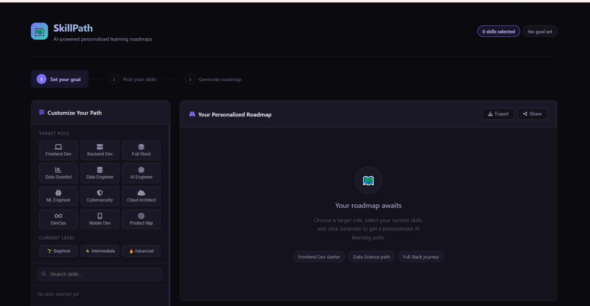
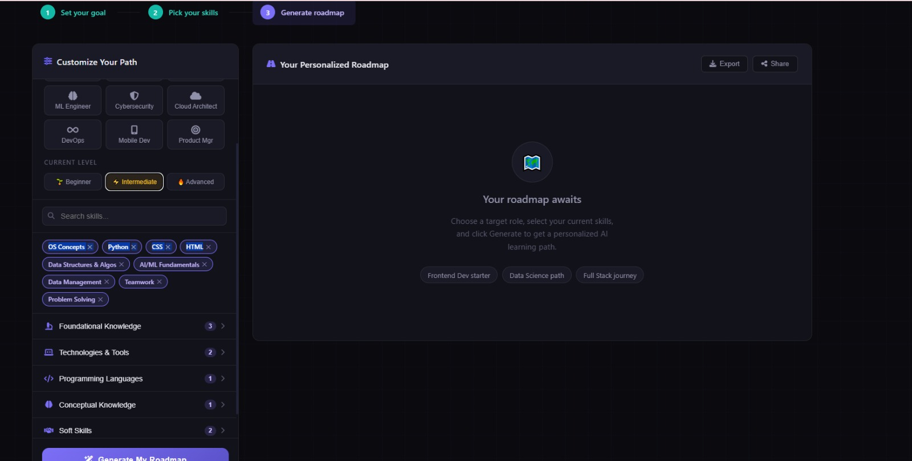
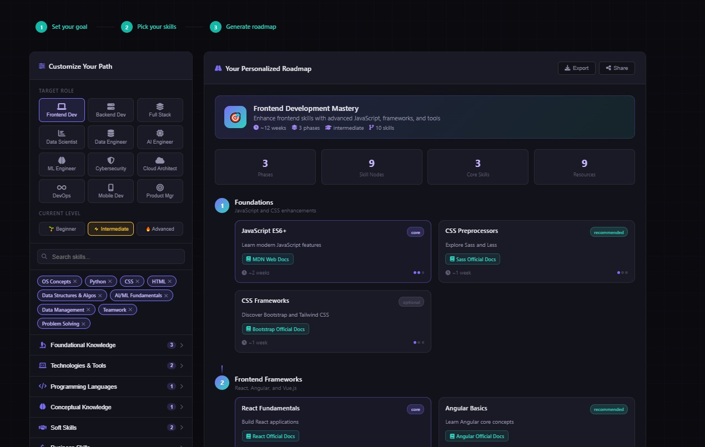

# 🗺️ SkillPath — AI-Powered Personalized Learning Roadmaps

**SkillPath** generates custom, step-by-step developer learning roadmaps using AI. Pick your target role, select your current skills, and get a personalized path with curated resources — in seconds.

🔗 **Live Demo:** [skill-path-swart.vercel.app](https://skill-path-swart.vercel.app/)

---

## ✨ Features

- **12 Target Roles** — Frontend, Backend, Full Stack, Data Scientist, ML Engineer, AI Engineer, DevOps, Cloud Architect, Cybersecurity, Data Engineer, Mobile Dev, Product Manager
- **Smart Role Suggestion** — Automatically detects your best-fit role based on your selected skills
- **3-Phase Roadmap** — Every roadmap is structured into logical phases with core, recommended, and optional skill nodes
- **Curated Resources** — Each skill node includes real links to docs, YouTube tutorials, and courses
- **Skill Search** — Instantly filter across 70+ skills across 6 categories
- **Feedback System** — Star rating popup with responses stored in Google Sheets
- **Export & Share** — Print or share your roadmap with one click
- **Fully Responsive** — Works on mobile, tablet, and desktop

---

## 📸 Screenshots

### Home — Set Your Goal


### Skill Selection with Auto Role Suggestion


### Generated Roadmap


---

## 🛠️ Tech Stack

| Layer | Technology |
|---|---|
| Frontend | Vanilla HTML, CSS, JavaScript |
| AI Backend | Claude API (claude-sonnet) via `/api/generate` |
| Deployment | Vercel |
| Feedback Storage | Google Sheets (via Google Apps Script) |
| Icons | Font Awesome 6 |

---

## 🚀 How It Works

1. **Select a target role** — choose from 12 developer career paths
2. **Pick your current skills** — from 70+ skills across 6 categories (Foundational, Technologies, Languages, Conceptual, Soft Skills, Business)
3. **Set your level** — Beginner, Intermediate, or Advanced
4. **Generate** — Claude AI builds a 3-phase roadmap tailored to your exact skill gaps
5. **Follow the path** — each node shows duration, difficulty, and direct resource links

---

## 📁 Project Structure

```
/
├── index.html          # Main app (single-page, all CSS + JS inline)
├── robots.txt          # SEO crawler instructions
├── sitemap.xml         # Google sitemap
├── api/
│   └── generate.js     # Vercel serverless function — proxies Claude API
└── googlea8246acd87f553c4.html  # Google Search Console verification
```

---

## 🔧 Running Locally

```bash
# Clone the repo
git clone https://github.com/Safa-Jahangir/Skill.git
cd Skill

# Install Vercel CLI
npm install -g vercel

# Add your Anthropic API key
echo "ANTHROPIC_API_KEY=your_key_here" > .env

# Run locally
vercel dev
```

Then open `http://localhost:3000`

---

## 🌐 Deployment

Deployed on **Vercel** with automatic deployments from the `main` branch. The `/api/generate` serverless function handles Claude API calls server-side so the API key is never exposed to the client.

---

## 👩‍💻 Author

**Safa Jahangir**  
Software Engineering Student — Fatima Jinnah Women's University  
[GitHub](https://github.com/Safa-Jahangir) · [LinkedIn](https://www.linkedin.com/in/safa-jahangir)

---

## 📄 License

MIT License — free to use and modify.
